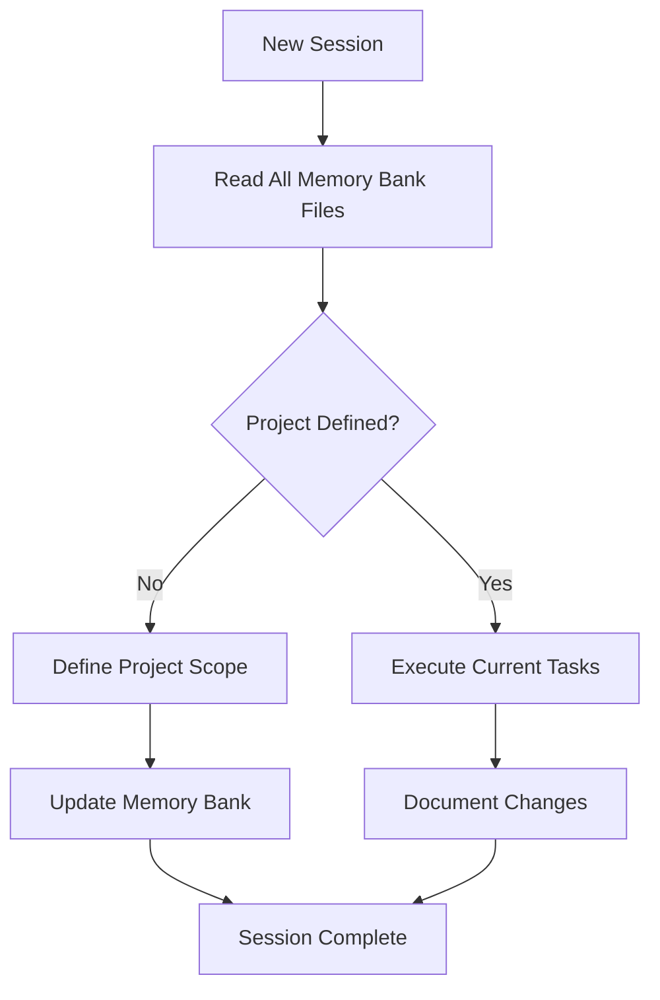

# Project Codex-K0

> **AI Agent Memory Bank System** - A comprehensive documentation framework designed for seamless AI agent continuity and project development.

## Overview

This project implements a complete Memory Bank system that enables AI agents to maintain perfect context continuity across sessions. The system is designed to be self-instructive, comprehensive, and immediately actionable for any AI agent that needs to pick up work on a project.

## Memory Bank Architecture

The Memory Bank follows a hierarchical structure where each file serves a specific purpose and references others to maintain consistency without duplication:

```
📁 memory-bank/
├── 📄 projectbrief.md      (Foundation - project scope and objectives)
├── 📄 productContext.md    (Purpose - why the project exists)
├── 📄 systemPatterns.md    (Architecture - how it's built)
├── 📄 techContext.md       (Implementation - technologies used)
├── 📄 activeContext.md     (Current - immediate work state)
└── 📄 progress.md          (Evolution - what works, what's left)
```

## Quick Start for AI Agents

### Mandatory First Steps

1. **Read AGENTS.md** to load agent lifecycle and memory protocols
2. **Read ALL Memory Bank files** in this order:
   - `projectbrief.md` → `productContext.md`, `systemPatterns.md`, `techContext.md` → `activeContext.md` → `progress.md`
3. **Identify [TO BE DEFINED] placeholders** that need completion
4. **Review .clinerules** for project-specific patterns and intelligence
5. **Update activeContext.md** before starting any new work

### Session Workflow



## File Purposes

### Core Memory Bank Files

**📄 projectbrief.md**

- Foundation document that shapes all others
- Defines project scope, objectives, and constraints
- Source of truth for what this project accomplishes

**📄 productContext.md**

- Why this project exists and what problems it solves
- User experience goals and success metrics
- Product vision and value proposition

**📄 systemPatterns.md**

- System architecture and design patterns
- Component relationships and technical decisions
- Critical implementation paths

**📄 techContext.md**

- Technology stack and development environment
- Dependencies, constraints, and tool usage patterns
- Setup instructions and configuration details

**📄 activeContext.md**

- Current work focus and immediate next steps
- Recent changes and active decisions
- Bridge between planning and implementation

**📄 progress.md**

- What's working vs. what needs work
- Project evolution and status tracking
- Historical context for decision making

### Configuration Files

**📄 .clinerules**

- Project-specific AI agent intelligence
- Memory Bank workflow protocols
- Learning patterns and critical success factors

**📄 AGENTS.md**

- Guidelines for AI agents and human collaborators
- Session lifecycle events and state management
- Self-evaluation loops and memory persistence protocols

## Template Features

### Self-Instructive Design

- Every file includes "Instructions for AI Agents" sections
- Update triggers explicitly documented
- Cross-references maintain consistency
- No external guidance required

### Placeholder System

- `[TO BE DEFINED]` marks incomplete information
- Easy identification of what needs completion
- Systematic approach to project definition

### Quality Assurance

- Cross-reference validation between files
- Version control integration assumed
- Hard enforcement of Memory Bank workflows

## Development Environment

**Current Context:**

- Working Directory: `/projects/annexes/codex-k0`
- Operating System: Linux 6.14
- Default Shell: `/bin/bash`
- Home Directory: `/home/luxcium`

**Available Tools:**

- Multiple MCP servers for GitHub, browser automation, git operations
- File management and code analysis tools
- Web fetching and search capabilities

## System Requirements

### Minimum Requirements

**Core System:**

- **Operating System**: Linux (Ubuntu 18.04+, CentOS 7+, Arch), macOS 10.15+, or Windows 10+ with WSL2
- **Shell**: Bash 4.0 or higher
- **Memory**: 512MB RAM minimum, 2GB recommended
- **Storage**: 100MB free space for dependencies
- **Network**: Internet connection for initial dependency installation

**Runtime Dependencies** (Auto-installed):

- **Node.js**: Version 14 LTS or higher
- **npm**: Version 6 or higher (included with Node.js)
- **curl**: For dependency downloads (usually pre-installed)

**Optional Tools:**

- **Git**: Version control (recommended for projects)
- **jq**: JSON processing (for config validation)
- **sudo**: For system-wide package installation

### Supported Platforms

| Platform | Status | Auto-Install | Package Manager |
|----------|--------|--------------|-----------------|
| Ubuntu/Debian | ✅ Full Support | Yes | apt-get |
| CentOS/RHEL 7+ | ✅ Full Support | Yes | yum |
| Arch Linux | ✅ Full Support | Yes | pacman |
| macOS 10.15+ | ✅ Full Support | Yes | brew |
| Windows WSL2 | ✅ Full Support | Yes | apt-get |
| Windows MinGW | ⚠️ Limited | Manual | n/a |

## Utility Scripts

The `scripts/` directory contains production-ready automation tools:

### markdownlint.sh - Production Markdown Linter

**Features:**

- **Battle-tested**: Comprehensive error handling and cross-platform support
- **Fully Automated**: Auto-installs Node.js and dependencies without prompts
- **Headless Ready**: Perfect for CI/CD pipelines and automated workflows
- **Configurable**: Supports custom configuration files and ignore patterns
- **Self-Healing**: Auto-fixes common markdown issues where possible

**Usage:**

```bash
# Lint all markdown files in project
./scripts/markdownlint.sh

# Lint specific files  
./scripts/markdownlint.sh README.md docs/*.md

# Auto-fix issues where possible
./scripts/markdownlint.sh --fix

# Silent mode for CI/CD
./scripts/markdownlint.sh --silent --check
```

**Configuration:**

- Config: `.markdownlint.json` (auto-created with sensible defaults)
- Ignores: `.markdownlintignore` (excludes common build/dependency folders)
- Logging: `.markdownlint.log` (detailed operation logs)

### env-info.sh - Environment Detection

`env-info.sh` detects runtime details such as container status, OS information, and environment metadata. Useful for troubleshooting and CI/CD context validation.

**See [scripts/README.md](scripts/README.md) for complete documentation.**

## Project Status

**Current Phase:** Memory Bank Template System Complete

**Ready for:**

- Project scope definition and planning
- Technical implementation using Memory Bank workflows
- Real-world testing of AI agent continuity

**Next Steps:**

1. Define actual project objectives (replace template placeholders)
2. Use Memory Bank system for concrete development work
3. Test and refine Memory Bank effectiveness

## Usage Guidelines

### For New Projects

1. Clone this repository structure
2. Update `projectbrief.md` with actual project scope
3. Replace all `[TO BE DEFINED]` placeholders with real information
4. Follow Memory Bank workflows for all development work

### For AI Agents

1. **ALWAYS** read all Memory Bank files before starting work
2. Update `activeContext.md` before beginning new tasks
3. Document all changes and insights immediately
4. Follow session protocols defined in `.clinerules`

### For Human Developers

1. Treat Memory Bank as single source of truth
2. Update files when making significant changes
3. Use cross-references to maintain consistency
4. Contribute to project intelligence in `.clinerules`

## Key Principles

**Memory Persistence:** Every session starts fresh - Memory Bank is the only continuity mechanism

**Self-Instruction:** Templates and documentation must be complete and actionable without external guidance

**Comprehensive Coverage:** All aspects of project context captured and maintained

**Quality Enforcement:** Hard requirements for Memory Bank synchronization before work begins

**Evolution Tracking:** Project changes and learnings continuously documented

## Contributing

When contributing to projects using this Memory Bank system:

1. Read all Memory Bank files to understand current context
2. Update relevant files with your changes and insights
3. Maintain cross-references between related files
4. Document new patterns or learnings in appropriate files
5. Ensure `.clinerules` captures project-specific intelligence

## License

This Memory Bank template system is designed for maximum reusability and adaptation to any project type.

---

**For AI Agents:** This README provides project overview, but you MUST read all Memory Bank files for complete context. The Memory Bank is your authoritative source for project understanding and work continuation.
